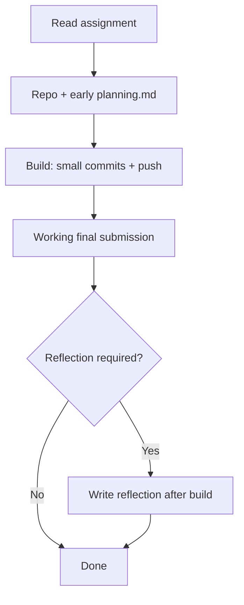

# CS1 / CS2: GitHub Assignment & `planning.md` Guide (Instructor + Student)

This document combines **course policy**, a **student one-pager**, **grading rubrics** (planning plus optional process and reflection), and **concrete examples** so assignments stay consistent across **CS1 (web)**, **CS2 (programming)**, and **CS2 / VEX Robotics** when you use GitHub for the robot program.

**Related files (same folder):** [assignment_workflow.md](assignment_workflow.md) · [planning_web.md](planning_web.md) · [planning_codes.md](planning_codes.md) · [planning_vex.md](planning_vex.md) · [commits_process_examples.md](commits_process_examples.md) · [reflection_examples.md](reflection_examples.md) · [planing_rubrics.md](planing_rubrics.md)

**Jump to sections:** [Overview — Full workflow](#overview) · [Part A — Policy](#part-a) · [Part B — Student one-pager](#part-b) · [Part C — Rubric](#part-c) · [Part D — Web example](#part-d) · [Part E — Code example](#part-e) · [Part K — VEX Robotics](#part-k) · [Part F — Weak example](#part-f) · [Part I — Commit examples](#part-i) · [Part J — Reflection examples](#part-j) · [Part G — LMS](#part-g) · [Part H — Optional rubrics](#part-h) · [File map](#file-map)

---

<h2 id="overview">Overview — The full assignment workflow (start → finish)</h2>

Standalone one-page copy (same content, easy to link): [assignment_workflow.md](assignment_workflow.md).

A typical GitHub-based CS assignment is **not** only the final files. It is a **visible sequence**: plan first, build in steps, submit working work, then (if required) reflect. [Part A](#part-a) states the course policy for each stage; the sections below give detail, rubrics, and examples.

### Steps (what to do, in order)

1. **Read the assignment** — Note deliverables, constraints, and whether **reflection** (or a commit minimum) is graded.
2. **Start the repo** — Create or use the course repo; keep all work **in that repository** unless the instructor says otherwise.
3. **Write `planning.md` early** — Before substantial coding, site building, or **robot program** work, commit a **specific** plan (task, breakdown, time, risks, first step). See [Part B](#part-b), [Part C](#part-c), and examples [Part D](#part-d) / [Part E](#part-e) / **[Part K (VEX)](#part-k)**.
4. **Build with steady commits** — Implement in **small, meaningful** chunks; push so the history shows **real progress over time**, not one bulk upload. See [Middle process](#part-a) under Part A and [Part I](#part-i) (includes a **VEX** commit pattern).
5. **Finish the submission** — Deliver the required **working** program, site, or **robot project** (whatever the prompt asks for; VEX teams: see [Part K](#part-k) for what “done” usually means).
6. **Reflection (if assigned)** — After the build works, write the reflection in the **format your assignment specifies** (`reflection.md`, LMS, or a section in `planning.md`). See [Closing reflection](#part-a) under Part A and [Part J](#part-j).
7. **Deadline** — Confirm the default branch shows `planning.md`, your final **code / site / VEX project files** (per assignment), any required reflection, and a commit history that matches the expectations above.

### Flow (same idea, one picture)



**Grading note.** [Part C](#part-c) scores **`planning.md` only**. [Part H](#part-h) is for instructors who also grade **commits** and/or **reflection** on separate point lines.

---

<h2 id="part-a">Part A — GitHub assignment policy (course-level)</h2>

**Purpose.** Strong computer science work does not begin with random coding. It begins with clear planning, visible progress, and honest reflection. Your GitHub repository is the **process record** for that work. For the **ordered workflow** (plan → commits → submit → reflect), see [Overview — The full assignment workflow](#overview).

**What students maintain in the repo**

| Artifact | Role |
|----------|------|
| `planning.md` | **Start:** shows how they understood the task before building |
| Commits | **Progress:** small, meaningful steps over time |
| Final code / site | **Result:** working submission |
| Reflection (where assigned) | **Close:** what changed, what was hard, what they learned |

**Expectations**

- `planning.md` must exist **before** substantial implementation work begins (same repo, early commit).
- Commits should be **frequent enough** to show real progress (not one giant upload at the deadline).
- Planning should be **specific**: task, breakdown, time, risks, first step — not vague intentions.

### Middle process (commits)

Commits are how you show **ongoing work**, not only the final file set. Instructors may set a minimum (for example, “at least N commits after `planning.md`”) in the assignment; if no number is given, the standard is still **steady, meaningful steps** rather than a single bulk upload at the deadline.

**Strong practice**

- Commit after a **small, logical** unit of progress (a feature, a fix, a section of the page).
- Use **short, informative** messages (what changed and why), not vague text like “update” with no context.
- Push regularly so the history **spans the days** you actually worked, when that applies to the task length.

Concrete **strong vs weak** commit logs (illustrative): [Part I — Examples: middle process](#part-i).

### Closing reflection

Reflection is **required only when the assignment says so** (for example: add `reflection.md`, answer prompts in the LMS, or append a **Reflection** section after you finish). When it is assigned, it should be **after** the main build, so you can compare the outcome to your plan.

A useful reflection is **specific to this project**, not only generic phrases. It often includes:

- **What changed** compared to `planning.md` (scope, order of work, surprises).
- **What was difficult** and how you addressed it (or what you would try next time).
- **What you learned** that you can name in one or two concrete sentences.

Sample reflections (strong vs weak): [Part J — Examples: reflection](#part-j).

---

<h2 id="part-b">Part B — Student one-pager: what <code>planning.md</code> is for</h2>

Each CS task must include a **`planning.md`** file in the GitHub repository.

Your `planning.md` is **not** just a short note. It should clearly show:

- **What the task is** (restated in your own words)
- **How you break the problem into smaller parts**
- **How you plan your time**
- **What challenges you expect**
- **What you will do first**

This file is part of your grade because planning is part of professional CS practice.

### Writing standard: specific beats vague

A strong `planning.md` should be **specific**. It should **not** rely only on phrases like:

- “I will do the project”
- “I will code first”
- “I will try my best”

Instead, it should clearly explain:

- What the task requires
- What smaller steps you will complete
- When you will complete them
- What might be difficult
- What you will do first

### What to paste in the assignment instructions

Before you begin the main build, you must create a **`planning.md`** file in your GitHub repository.

This file should show:

- How you understand the task
- How you break it down
- How you plan your time
- What you will do first

This is graded work. A good plan is **specific**, **realistic**, and **useful**.

### When reflection is assigned

Follow the **prompt and format** in the assignment (file name, LMS questions, or a section in `planning.md`). Unless told otherwise, write the reflection **after** you have a working submission, and refer to **actual** parts of your work (files, features, bugs) instead of only general statements.

Illustrative **strong vs weak** samples: [Part J](#part-j).

---

<h2 id="part-c">Part C — <code>planning.md</code> rubric (4 points)</h2>

Standalone copy (rubric only): [planing_rubrics.md](planing_rubrics.md)

| Score | Level | Criteria |
|-------|--------|----------|
| **4** | Strong | Clearly explains the task; breaks the task into useful smaller parts; includes a realistic time plan; identifies possible challenges; states a clear first step |
| **3** | Satisfactory | Explains the task; includes some breakdown and time planning; may be missing detail in one area |
| **2** | Weak | Planning is too general; task breakdown is unclear; time plan is incomplete or unrealistic |
| **1** | Very weak | Planning is vague; little or no real problem breakdown; no meaningful time planning |

**Note.** [Part H](#part-h) adds **optional** rubrics for **commit history** and **reflection** when you want those items scored separately. Part C alone does not grade mid-project commits or post-project reflection.

---

<h2 id="part-d">Part D — Example 1 (CS1 / web): strong <code>planning.md</code></h2>

Standalone copy (example only): [planning_web.md](planning_web.md)

**Assume the assignment:** Build a personal portfolio webpage with a homepage, an about section, a projects section, and a contact form.

### Why this example is “strong”

- States the **actual task** and deliverables  
- **Decomposes** work into ordered steps with sub-bullets  
- Uses a **day-by-day** time plan  
- Names **concrete** risks (layout, nav, form, time management)  
- **First step** is actionable (sketch structure → HTML before CSS)

```markdown
# Planning.md

## Task
I need to build a personal portfolio webpage. The website should include:
- a homepage
- an about section
- a projects section
- a contact form

The goal is to create a clear and organized website that works correctly and looks clean.

## Problem Breakdown
I will break this task into smaller parts:

1. Plan the structure of the webpage
   - decide the sections
   - decide the order of the content

2. Build the basic HTML structure
   - create header
   - create navigation
   - create each section

3. Add CSS styling
   - set colors
   - choose fonts
   - improve layout
   - make spacing cleaner

4. Build the contact form
   - add input fields
   - add submit button

5. Test and improve
   - check if links work
   - check if layout looks correct
   - fix any errors

## Time Plan
Day 1:
- plan the page structure
- create the basic HTML for all sections

Day 2:
- add navigation and improve content structure
- begin CSS styling

Day 3:
- continue CSS styling
- make the page cleaner and easier to read

Day 4:
- build the contact form
- test buttons and layout

Day 5:
- fix problems
- improve small details
- write reflection (if the assignment requires it)
- submit final version

## Possible Challenges
- making the layout look clean
- keeping the navigation organized
- making sure the contact form is structured correctly
- managing time so I do not leave all styling to the last minute

## First Step
My first step is to sketch the page structure and then build the basic HTML sections before I focus on styling.
```

---

<h2 id="part-e">Part E — Example 2 (CS2 / programming): strong <code>planning.md</code></h2>

Standalone copy (example only): [planning_codes.md](planning_codes.md)

**Assume the assignment:** Write a program that reads a list of numbers and returns the largest number, the smallest number, and the average.

### Why this fits CS2

It practices **input/output thinking**, **variable planning**, **algorithm breakdown**, and **test-case awareness**.

**VEX Robotics (CS2).** If your course uses **VEX V5 / IQ programming** in GitHub, use the same rubric and workflow, but read **[Part K — VEX Robotics](#part-k)** and the standalone example **[planning_vex.md](planning_vex.md)**.

```markdown
# Planning.md

## Task
I need to write a program that reads a list of numbers and outputs:
- the largest number
- the smallest number
- the average

The program should work correctly for a normal list of integers.

## Problem Breakdown
I will break the task into these parts:

1. Understand the input and output
   - input: a list of numbers
   - output: max, min, average

2. Decide how to solve the problem
   - use variables to store current max and min
   - use a running total to calculate average
   - divide total by the number of items

3. Write the basic program structure
   - read the numbers
   - loop through the list
   - update max and min
   - calculate total
   - print results

4. Test the program
   - test with positive numbers
   - test with repeated numbers
   - test with one number

5. Fix errors and improve code
   - check variable names
   - check logic
   - make output clear

## Time Plan
Day 1:
- understand the problem
- write pseudocode
- decide the main variables

Day 2:
- write the loop
- calculate max, min, and total

Day 3:
- calculate average
- print the results
- fix syntax errors

Day 4:
- test with different inputs
- fix logic mistakes

Day 5:
- clean up the code
- write reflection (if the assignment requires it)
- submit final version

## Possible Challenges
- making sure max and min start correctly
- remembering to divide by the correct length
- testing edge cases like a list with only one number

## First Step
My first step is to write pseudocode for how the loop will update max, min, and total.
```

---

<h2 id="part-k">Part K — CS2 / VEX Robotics: running the same GitHub workflow</h2>

Standalone copy (example only): [planning_vex.md](planning_vex.md)

VEX work is still **computing**: sensors, control loops, state, testing, and iteration. The repository is the **process record for the program** (and any text artifacts you require). Mechanical build may happen in the lab; the **graded software trail** should still show planning → incremental commits → a working routine.

### What should live in GitHub?

State the rule in your assignment. A common setup:

- **VEXcode project source** students can open and build (for example the project folder / `.v5code` + source files your toolchain produces—keep it consistent across the class).
- **`planning.md`**, committed **before** large autonomous or driver-control changes (same rule as Part A).
- Optional but useful: a short **`README.md`** with robot **motor/sensor port map**, how to run autonomous, and (if you allow it) a link to a **short test video**.

**Not everything must be Git.** If notebooks or CAD live elsewhere, say so—but do not leave the **code history** empty or “one upload at the deadline.”

### Instructor prompt language (copy / adapt)

- “Create `planning.md` **before** you write your full autonomous routine. Commit it in the same repo as your VEXcode project.”
- “Make **small commits** as you go (driver control, forward move, turn, tuning). Messages must say **what** changed (sensor, constant, subsystem), not only `update`.”
- “Your submission is **pushed to GitHub** on the default branch by the deadline, with **planning.md**, the **latest program**, and (if assigned) **`reflection.md`**.”
- Define **done** precisely: e.g. “autonomous completes forward + 90° turn from the taped start line **3 times in a row** within ±6 inches / ±10°” (adjust to your classroom).

### Student map: how this guide lines up with a robot project

| Stage | What you do (VEX) | Where it shows |
|------|---------------------|----------------|
| **Start** | Restate the task in field terms; break into subsystems (driver, autonomous segments, sensors); time plan; risks; first step | `planning.md` (see [planning_vex.md](planning_vex.md)) |
| **Middle** | Commit after each logical improvement: ports fixed, forward PID/distance, turn tuning, reliability fixes | Git history ([Part I](#part-i), pattern C) |
| **Result** | Program builds and meets the instructor’s **definition of done** | Default branch project files |
| **Close** | What changed vs plan, tuning pain points, sensor/real-world issues (if reflection is assigned) | `reflection.md` or LMS ([Part J](#part-j) style) |

### Example: strong `planning.md` for a VEX autonomous + driver task

The standalone file **[planning_vex.md](planning_vex.md)** matches the same sections as Part B (task, breakdown, time, challenges, first step) for a **distance + inertial turn** autonomous with driver control for testing.

### Why commits still matter on a robot team

Tuning is a sequence of **hypothesis → change → test**. Commits should mirror that: “reduce turn speed after overshoot,” “add inertial cal wait,” “fix reversed left drive.” That is the robotics version of the same professional habit as Part I.

---

<h2 id="part-f">Part F — Weak example: what <em>not</em> to submit</h2>

```markdown
# Planning

I will make the project first.
Then I will do the code.
After that I will finish the design.
I think it will be hard.
I will try my best.
```

### Why this fails the rubric

- No **concrete** description of the assignment requirements  
- No **real** decomposition (only generic phases)  
- No **time plan**  
- No **specific** difficulties  
- “Try my best” adds **no** actionable information  

---

<h2 id="part-i">Part I — Examples: middle process (commit history)</h2>

Standalone copy (examples only): [commits_process_examples.md](commits_process_examples.md)

These logs are **illustrative** (fake dates). They show the *shape* of good process: **planning first**, then **small steps** with **clear messages** spread across the days you work. Your real repository should match that idea using your actual timeline.

### Strong pattern A — CS1 / web (same assignment idea as Part D)

Assume a multi-day portfolio task. A plausible history (newest commit listed first, like GitHub):

```text
Apr 10  Fix contact form layout on narrow screens; adjust footer spacing
Apr 9   Add contact form fields, labels, and basic styling
Apr 8   Style Projects section: grid layout and card spacing
Apr 7   Add global CSS: colors, fonts, nav layout, section spacing
Apr 6   Fill About + Projects content; link nav items to section ids
Apr 5   Create index.html skeleton: header, nav, sections, footer
Apr 4   Add planning.md with task breakdown and time plan
```

**Why this reads as “strong” process**

- `planning.md` appears **before** the main HTML/CSS build.  
- Each message names a **concrete** chunk of work (not “update”).  
- History **spreads across days**, matching steady progress instead of one dump at the deadline.

### Strong pattern B — CS2 / programming (same assignment idea as Part E)

Assume the max / min / average program from Part E:

```text
Apr 10  Clarify output format; handle empty input safely
Apr 9   Add checks for repeated values and single-number list
Apr 8   Compute average using correct list length; fix rounding display
Apr 7   Loop: update min, max, and running total
Apr 6   Read input into a list; scaffold main() and printing
Apr 5   Add planning.md with pseudocode and variable plan
```

**Why this fits CS2**

- Planning lands **before** the core loop logic.  
- Testing and edge cases show up as **their own** commits, not mixed into one “finished program” upload.

### Strong pattern C — CS2 / VEX Robotics (same idea as Part K / [planning_vex.md](planning_vex.md))

Assume a classroom task: **autonomous** forward distance + **inertial** turn, plus **driver control** for testing.

```text
Nov 12  Autonomous: slow turn speed; stop overshoot on 90° target
Nov 11  Combine forward → turn → brake in autonomous(); add timeouts
Nov 10  Autonomous turn routine using inertial heading error
Nov 9   Encoder-based forward distance move (inches → motor units)
Nov 8   Driver control: arcade drive; confirm motor directions
Nov 7   Add planning.md (routine steps, sensor plan, field test plan)
```

**Why this fits VEX**

- `planning.md` lands **before** the main autonomous stack.  
- Commits track **subsystem progress** (driver → forward → turn → integration → tuning), which matches how robot work actually happens.

### Weak pattern — what *not* to do

**Single bulk upload**

```text
Apr 10  final project files
```

**Vague messages, same-day burst**

```text
Apr 10  done
Apr 10  updates
Apr 10  more changes
```

**Why this fails the “middle process” idea**

- There is **no readable trail** of how the work unfolded.  
- Messages do not tell a grader (or future you) **what** changed.  
- Everything landing on **one day** often means the history does not reflect real incremental work—even if the final code is fine.

---

<h2 id="part-j">Part J — Examples: reflection (after you finish)</h2>

Standalone copy (examples only): [reflection_examples.md](reflection_examples.md)

Use these when the assignment asks for a written reflection (for example `reflection.md` or a final section in the LMS). They match the **same task ideas** as Part D (web portfolio) and Part E (max / min / average), but the text is **illustrative**—replace details with your real experience. **VEX teams:** keep the same three-part structure (plan vs reality, difficulties, learning) but name **sensors, subsystems, field tests, and tuning** instead of only generic “coding.”

### Strong pattern A — CS1 / web (portfolio task from Part D)

```markdown
# Reflection

## What changed compared to my plan
In `planning.md` I said I would finish most CSS before starting the contact form. In practice, I built the form HTML on Day 4 earlier than planned because I wanted to see the full page structure first. I also spent extra time on the Projects section grid; I did not expect the cards to wrap awkwardly until I had real content in `index.html`.

## What was difficult
The contact form was harder than I expected. Labels and inputs did not line up until I adjusted the CSS for the form container and added consistent spacing. On small screens, the footer felt too tall next to the form, so I changed padding in `styles.css` and tested with the browser resize tools.

## What I learned
I learned that it helps to build a simple HTML skeleton for every required section early, even if the styling is ugly at first. I also learned to test layout changes at two widths (wide and narrow) so I do not fix one view and break the other.
```

**Why this reads as “strong”**

- Names **real artifacts** (`planning.md`, `index.html`, `styles.css`) and **specific** issues (grid wrap, form layout, mobile footer).  
- Explains a **real plan change** (order of work), not only “I followed the plan.”  
- States **actionable** learning tied to the assignment type (HTML/CSS workflow).

### Strong pattern B — CS2 / programming (max / min / average from Part E)

```markdown
# Reflection

## What changed compared to my plan
My plan said I would calculate the average inside the same loop as min and max. I kept that approach, but I almost divided by the wrong value until I reread the instructions. I also added a separate commit for the single-number case after my first tests failed.

## What was difficult
Initializing `min` and `max` was confusing at first. I started both at zero, which broke the case where every number is negative. I fixed it by setting both to the first list element before the loop. Testing edge cases took longer than I expected because I had to think about empty input separately from a one-item list.

## What I learned
I learned that “obvious” starting values for variables are not always correct; the first real data point is often the safest initializer for min/max problems. I also learned to write down two or three test cases before I debug, instead of only testing the happy path.
```

**Why this fits CS2**

- Connects reflection to **logic choices** (initialization, division, edge cases).  
- Shows **debugging behavior** that a grader can recognize as authentic.

### Weak pattern — what *not* to submit

```markdown
# Reflection

This project was pretty hard. I learned a lot about coding and HTML. Next time I will start earlier and manage my time better. Overall I think it went okay.
```

**Why this fails the reflection rubric**

- No **project-specific** detail (no files, features, bugs, or plan comparison).  
- Phrases like “learned a lot” do not say **what** was learned.  
- “Start earlier” could apply to **any** assignment, so it does not show thinking about **this** task.

---

<h2 id="part-g">Part G — Optional LMS blocks (if your platform uses custom callouts)</h2>

If your course site supports tagged callouts (e.g. `:::writing{...}`), you can wrap **Overview**, **Part B**, **Part C**, **Part K**, **Part I**, **Part J**, and **Part H** excerpts in those components. The **substance** is already given above in plain Markdown.

---

<h2 id="part-h">Part H — Optional add-on rubrics (process + reflection)</h2>

Use these when the assignment explicitly includes **graded** process and/or reflection. Point values below assume **4 points each**; you may rescale (for example, 2 points each) by halving scores or merging levels.

Standalone copy (all rubrics): [planing_rubrics.md](planing_rubrics.md)

### H.1 — Commit history / process (optional, 4 points)

Example logs (strong vs weak): [Part I](#part-i) (includes **VEX** pattern C).

| Score | Level | Criteria |
|-------|--------|----------|
| **4** | Strong | Multiple meaningful commits across the work period; messages usually say *what* changed; history shows steady progress, not one bulk upload at the end |
| **3** | Satisfactory | Several commits with mostly clear messages; some clustering late or minor gaps, but process is still visible |
| **2** | Weak | Few commits and/or vague messages; little evidence of iterative work |
| **1** | Very weak | Essentially a single upload or unreadable history; no plausible trail of development |

### H.2 — Reflection (optional, 4 points; use when reflection is assigned)

Example reflections (strong vs weak): [Part J](#part-j).

| Score | Level | Criteria |
|-------|--------|----------|
| **4** | Strong | Specific about what changed vs the plan, what was difficult, and what was learned; ties claims to concrete parts of the project |
| **3** | Satisfactory | Addresses outcomes and at least one genuine challenge or learning point; some parts stay general |
| **2** | Weak | Mostly generic (“it was hard,” “I learned a lot”) with little project-specific detail |
| **1** | Very weak | Missing, extremely short, or does not answer the assigned prompts |

---

<h2 id="file-map">File map in this folder</h2>

| File | Contents |
|------|----------|
| [assignment_workflow.md](assignment_workflow.md) | Full workflow only (mirrors Overview at top of this guide) |
| [CS_GITHUB_PLANNING_GUIDE.md](CS_GITHUB_PLANNING_GUIDE.md) | **This file:** overview workflow + policy + student guide + rubrics + examples |
| [planning_web.md](planning_web.md) | CS1 web example only |
| [planning_codes.md](planning_codes.md) | CS2 programming example only |
| [planning_vex.md](planning_vex.md) | CS2 / VEX Robotics `planning.md` example only |
| [commits_process_examples.md](commits_process_examples.md) | Middle process (commit log) examples only |
| [reflection_examples.md](reflection_examples.md) | Reflection (strong vs weak) examples only |
| [planing_rubrics.md](planing_rubrics.md) | Rubrics only: Part C + optional Part H (process, reflection) |
