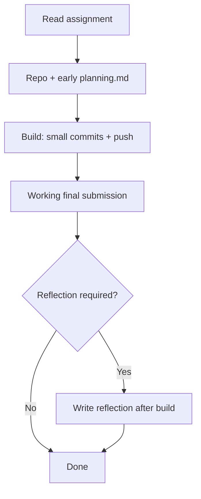

# The full assignment workflow (start → finish)

[← Full guide: CS_GITHUB_PLANNING_GUIDE.md](CS_GITHUB_PLANNING_GUIDE.md) · [Same section inside the guide](CS_GITHUB_PLANNING_GUIDE.md#overview)

A typical GitHub-based CS assignment is **not** only the final files. It is a **visible sequence**: plan first, build in steps, submit working work, then (if required) reflect. Course policy for each stage is in [Part A](CS_GITHUB_PLANNING_GUIDE.md#part-a); the full guide adds rubrics and examples.

**VEX Robotics (CS2):** use the same steps, but read **[Part K — VEX Robotics](CS_GITHUB_PLANNING_GUIDE.md#part-k)** for what goes in the repo, how to phrase “done,” and a sample **[planning_vex.md](planning_vex.md)**.

## Steps (what to do, in order)

1. **Read the assignment** — Note deliverables, constraints, and whether **reflection** (or a commit minimum) is graded.
2. **Start the repo** — Create or use the course repo; keep all work **in that repository** unless the instructor says otherwise.
3. **Write `planning.md` early** — Before substantial coding, site building, or **robot program** work, commit a **specific** plan (task, breakdown, time, risks, first step). See [Part B](CS_GITHUB_PLANNING_GUIDE.md#part-b), [Part C](CS_GITHUB_PLANNING_GUIDE.md#part-c), and examples [Part D](CS_GITHUB_PLANNING_GUIDE.md#part-d) / [Part E](CS_GITHUB_PLANNING_GUIDE.md#part-e) / **[Part K + planning_vex.md](CS_GITHUB_PLANNING_GUIDE.md#part-k)**.
4. **Build with steady commits** — Implement in **small, meaningful** chunks; push so the history shows **real progress over time**, not one bulk upload. See [Middle process](CS_GITHUB_PLANNING_GUIDE.md#part-a) under Part A, [commit examples](commits_process_examples.md) (includes **VEX**), and [Part I](CS_GITHUB_PLANNING_GUIDE.md#part-i) in the full guide.
5. **Finish the submission** — Deliver the required **working** program, site, or **VEX project** (whatever the prompt asks for; VEX: see [Part K](CS_GITHUB_PLANNING_GUIDE.md#part-k)).
6. **Reflection (if assigned)** — After the build works, write the reflection in the **format your assignment specifies** (`reflection.md`, LMS, or a section in `planning.md`). See [Closing reflection](CS_GITHUB_PLANNING_GUIDE.md#part-a) under Part A and [reflection examples](reflection_examples.md).
7. **Deadline** — Confirm the default branch shows `planning.md`, your final **code / site / VEX project** (per assignment), any required reflection, and a commit history that matches the expectations above.

## Flow (same idea, one picture)

## Grading note

[Part C](CS_GITHUB_PLANNING_GUIDE.md#part-c) scores **`planning.md` only**. [Part H](CS_GITHUB_PLANNING_GUIDE.md#part-h) is for instructors who also grade **commits** and/or **reflection** on separate point lines. Rubrics only: [planing_rubrics.md](planing_rubrics.md).
